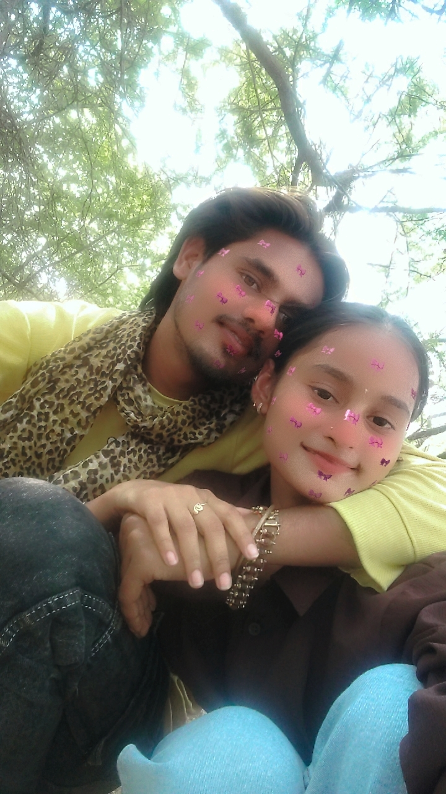

<!DOCTYPE html>
<html lang="en">
<head>
<meta charset="UTF-8">
<title>Happy Birthday Meli Pyali Biwi Jii ❤️</title>

</head>

<body>

<audio autoplay loop>
  <source src="HAPPY BIRTHDAY TO YOU PIANO INSTRUMENTAL BEST HAPPY BITHDAY MUSIC 2021 - Happy Birthday Music.mp3" type="audio/mpeg">
</audio>

<section>
  <h1>🎂 Happy Birthday</h1>
  <h1>Meli Pyali Biwi Jii ❤️</h1>
  
Scroll karo mela bacchaa 😘

</section>

<section>
  <h1>💖 From Someone Who Loves You</h1>
</section>

<section>
  <h1>📸 Memories</h1>
  

    
    
    
  

</section>

<section>
  <h1>💌 Message</h1>
  

Meri pyari jaan, aap meri zindagi ki sabse khoobsurat gift ho Mela Bacchaaa ❤️   
Aapki muskaan meri duniya ko roshan kar deti hai meli pyali biwi jii ✨   
Jab bhi aap paas hoti ho, har problem chhoti lagti hai Mela Bacchaaa 🥰   
Aap meri life ka sabse important hissa ho Mela Bacchaaa 💖   
Main har din bhagwan ka shukriya karta hoon aapko meri zindagi me bhejne ke liye Mela Bacchaaa 🙏   
Aapke bina sab kuch adhoora lagta hai meli ardhangini jii 😘   
Main hamesha aapko khush rakhne ki koshish karta rahunga Mela Bacchaaa 💕   
Aap meri strength bhi ho aur meri weakness bhi ho Mela Bacchaaa 💫   
Har pal bas aapke saath bitana chahta hoon Mela Bacchaaa 💑   
Happy Birthday meri jaan, aap hamesha aise hi muskuraati raho Mela Bacchaaa 🎂❤️  
  

</section>

<section>
  <h1>🎂 Make a Wish 🎂</h1>

  

    

      

      

      

    

    

  

  
✨ Make a wish ✨

</section>

</body>
</html>
